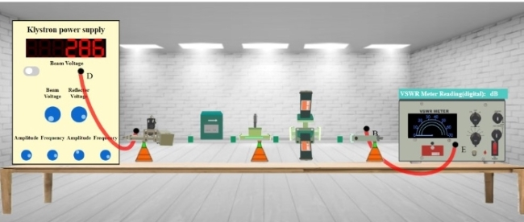
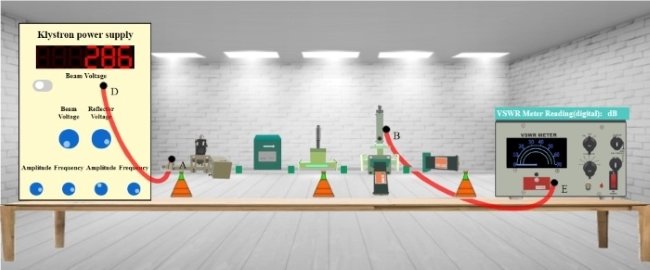

## Procedure 

### Instructions to Record the Value for P1

**Step-1:** Click on Components button for components to pop up.  
**Step-2:** Click on the "Components", drag them to the test bench and place them as shown in fig. 1.  
  

**Fig. 1 Setup for recording P1 values**

**Step-3:** After placing the components on the test bench, connect the wires accordingly.  
**Step-4:** If your connections are correct then you may continue to take down the readings, if not then click on "Reset Button" and try it again.  
**Step-5:** Move the "Beam Voltage" knob and set it to 250 or above to record your readings.  
**Step-6:** Toggle the switch button and move the "Reflector Voltage" knob to set the reflector voltage to maximum negative value.  
**Step-7:** As soon as you start varying the reflector voltage you will observe a waveform on CRO.  
**Step-8:** Keep varying the "Reflector voltage" till you get square waveform on CRO (You will get square waveforms at these values 180, 219 and 239 of voltage).  
**Step-9:** As soon as you observe square waveform on CRO, click on "VSWR Meter" button.  
**Step-10:** Note down the readings of VSWR Meter in input box for P1.  
**Step-11:** Click on "Add to table" button to record the readings for P1, Beam Voltage and Reflector Voltage.  
**Step-12:** Click on 'Print' button to print your current page (readings and connections) or to save your page (readings and connections) in a PDF form. After clicking on 'Print Button' set the layout as 'Landscape' to get a proper view of the page then go to more settings and click on the checkbox named 'Background graphics'.  
**Step-13:** Click on "Next" button.

  
  
### Instructions to Record the Value for P2

**Step-1:** Click on Components button for components to pop up.  
**Step-2:** Click on the "Components", drag them to the test bench and place them as shown in in fig. 2.  
  

**Fig. 2 Setup for recording P2 values**

  

**Step-3:** After placing the components on the test bench, connect the wires accordingly.  
**Step-4:** If your connections are correct then you may continue to take down the readings, if not then click on "Reset Button" and try it again.  
**Step-5:** Toggle the switch button and observe the readings on VSWR Meter for same value of Reflector Voltage.  
**Step-6:** Now the reading observed will be different as we are taking output from port 2 of Magic Tee.  
**Step-7:** Note down the readings in input box for P2.  
**Step-8:** Click on "Add to table" button to record the readings for P2.  
**Step-9:** Click on 'Print' button to print your current page (readings and connections) or to save your page (readings and connections) in a PDF form. After clicking on 'Print Button' set the layout as 'Landscape' to get a proper view of the page then go to more settings and click on the checkbox named 'Background graphics'.  
**Step-10:** Click on "Next" button.

  
  
### Instructions to Record the Value for P3

**Step-1:** Click on Components button for components to pop up.  
**Step-2:** Click on the "Components", drag them to the test bench and place them as shown in in fig. 3.  
  

**Fig. 3 Setup for recording P3 values**

  
**Step-3:** After placing the components on the test bench, connect the wires accordingly.  
**Step-4:** If your connections are correct then you may continue to take down the readings, if not then click on "Reset Button" and try it again.  
**Step-5:** Toggle the switch button and observe the readings on VSWR Meter for same value of Reflector Voltage.  
**Step-6:** Now the reading observed will be different as we are taking output from port 4 of Magic Tee.  
**Step-7:** Note down the readings in input box for P3.  
**Step-8:** Click on "Add to table" button to record the readings for P3.  
**Step-9:** Click on "Calculate" button to get the values of Coupling Coefficient and Isolation of magic tee.  
**Step-10:** Click on 'Print' button to print your current page (readings and connections) or to save your page (readings and connections) in a PDF form. After clicking on 'Print Button' set the layout as 'Landscape' to get a proper view of the page then go to more settings and click on the checkbox named 'Background graphics'.

