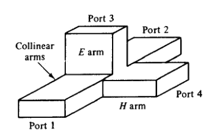
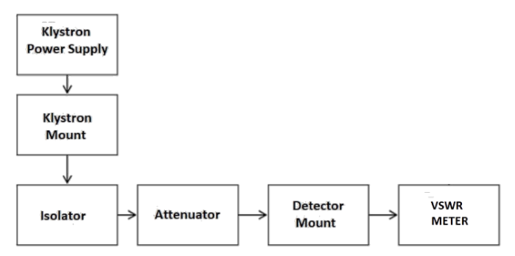
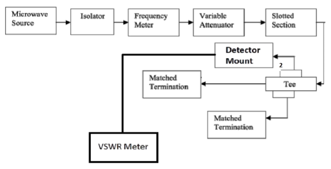
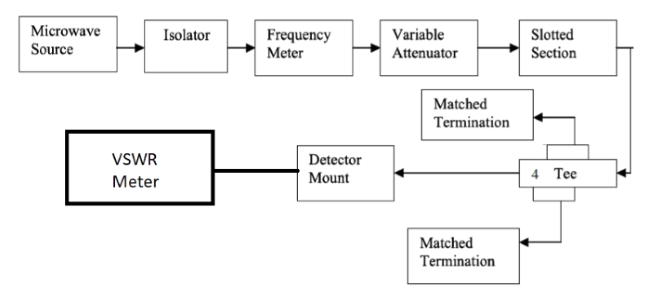

### Introduction

The Magic Tee is a four-port device & it is a combination of the E & H plane Tee. If the power is fed into arm 3 (H- arm), the electric field divides equally between arm 1 and 2 with same phase, and no electric field exists in arm 4. If the power is fed in arm 4 (E- arm), it divides equally into arm 1 and 2 but out of phase with no power to arm 3. Further, if the power is fed from arm 1 and 2, it is added in arm 3 (H-arm), and it is subtracted in E-arm, i.e., arm 4.  
  

**Fig. 1 Magic-Tee**

#### The basic parameters to be measured for Magic Tee are defined below:

1.  Isolation: The isolation between E and H arms is defined as the ratio of the power supplied by the generator connected to the E-arm (port 4) to the power detected at H-arm (port 3) when side arms 1 and 2 are terminated in matched load.  
    Hence,  

$$Isolation (3-4) = {10log_{10}} \frac{P4}{P3}$$
  
2.  Coupling Coefficient: It is defined as 

$$
C_{ij} = {10} - \frac{α}{20}
$$

&emsp;&emsp;&emsp;Where α is attenuation / isolation in db when 'i' is input arm and 'j' is output arm.  
&emsp;&emsp;&emsp;Thus 

$$
α = {10log_{10}} \frac{P_i}{P_j}
$$
 
&emsp;&emsp;&emsp;Where Pi is the power delivered to arm i and Pj is power detected at j arm.

### Block Diagram

*   ### **For P1:**
    
    

    

    **Fig. 2 Bench setup for recording P1 value**

    

   
    
*   ### **For P2:**
    
    

    

    **Fig. 3 Bench setup for recording P2 value**
    

    
*   ### **For P3:**
    
    

    

    **Fig. 4 Bench setup for recording P3 value**
    

    

